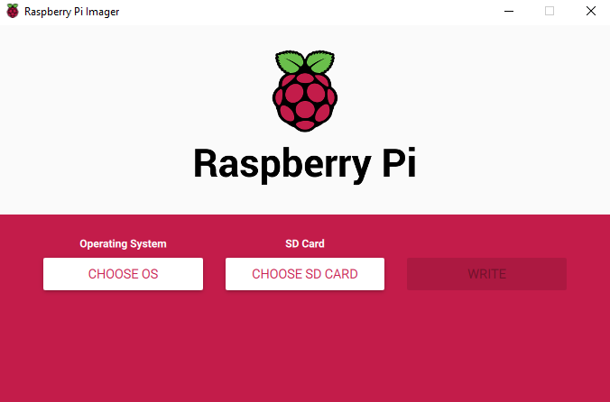

# Install ubuntu, ROS, and MAVSDK into CM4
 
## Flash eMMC
1.Switch Dip-Switch to RPI
2.Connect computer to USB-C CM4 Slave port used to power & flash the RPi.
3.Get usbboot, by installing it onto your main computer with ubuntu, by running these commands:
    sudo apt install libusb-1.0-0-dev
    git clone --depth=1 https://github.com/raspberrypi/usbboot,
    cd usbboot
    make
    sudo ./rpiboot
4.Install rpi-imager:
    sudo apt install rpi-image
    rpi-imager
    By running the "rpi-imager" command, you get the following:
    
    If possible, add WiFi and SSH settings (hidden behind the gear/advanced symbol).
5.Once done, unplugging USB-C CM4 Slave (this will unmount the volumes, and power off the CM4).
6.Switch Dip-Switch back to EMMC.
7.Power on CM4 by providing power to USB-C CM4 Slave port.

### Troubleshooting
#### Can't boot pass kernel
Have to rewrite the server image with other version, and repeat the whole step again

#### Keyboard/mouse not responding
Replug the host port a few times, or reboot

## Download desktop from server image
Before booting up CM4 in eMMC, connect a WLAN cable to CM4, or connect it through wifi, by setting up the following: https://www.youtube.com/watch?v=GVgMM_TFeOw

During setup, after booting, you will be required to enter your credentials in the terminal. the username and password are "ubuntu" by default. Then, change the password as prompted

Follow the following instructions: 
https://ubuntu.com/tutorials/how-to-install-ubuntu-on-your-raspberry-pi#4-boot-ubuntu-server
starting from 4.

For choosing between gdm3 and lightdm, choose whichever you want
